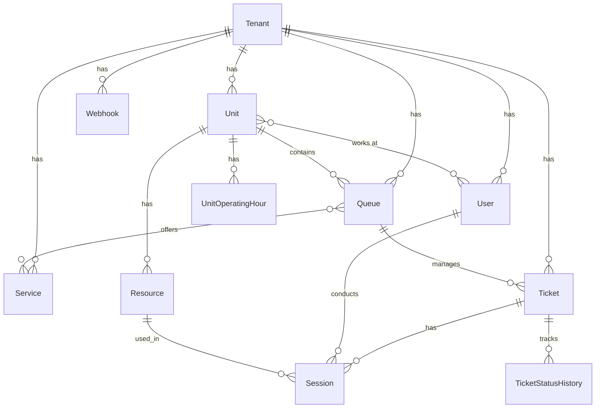

# 🗄️ Modelo de Dados

## Visão Geral

O sistema utiliza **PostgreSQL** como banco de dados principal, com **Entity Framework Core** como ORM. O modelo segue princípios de **Domain-Driven Design** com suporte completo para **multi-tenancy**.

## Diagrama ER Principal



## Entidades

### BaseEntity (Abstrata)

Classe base para todas as entidades do sistema.

| Campo | Tipo | Descrição | Constraints |
|-------|------|-----------|-------------|
| Id | Guid | Identificador único | PK |
| TenantId | Guid | ID do tenant | Required, Index |
| CreatedAt | DateTime | Data de criação | Required |
| CreatedBy | string | Usuário criador | Required, MaxLength(100) |
| UpdatedAt | DateTime? | Data de atualização | Nullable |
| UpdatedBy | string? | Usuário que atualizou | Nullable, MaxLength(100) |
| IsDeleted | bool | Soft delete flag | Default(false) |
| DeletedAt | DateTime? | Data de exclusão | Nullable |
| DeletedBy | string? | Usuário que excluiu | Nullable, MaxLength(100) |
| RowVersion | byte[] | Controle de concorrência | Timestamp |

### Tenant

Representa uma empresa/cliente no sistema multi-tenant.

| Campo | Tipo | Descrição | Constraints |
|-------|------|-----------|-------------|
| Name | string | Nome da empresa | Required, MaxLength(200) |
| Subdomain | string | Subdomínio único | Required, Unique, MaxLength(50) |
| IsActive | bool | Status ativo | Default(true) |
| Settings | string? | Configurações JSON | Nullable |
| ExpiresAt | DateTime? | Data de expiração | Nullable |

**Índices:**
- `IX_Tenants_Subdomain` (Unique)
- `IX_Tenants_IsActive_ExpiresAt`

### User

Usuários do sistema (atendentes, gerentes, etc.).

| Campo | Tipo | Descrição | Constraints |
|-------|------|-----------|-------------|
| Email | string | Email único | Required, MaxLength(256), Unique per Tenant |
| PasswordHash | string | Hash da senha | Required |
| Name | string | Nome completo | Required, MaxLength(200) |
| Role | UserRole | Papel do usuário | Required, Enum |
| IsActive | bool | Status ativo | Default(true) |
| LastLoginAt | DateTime? | Último login | Nullable |
| RefreshToken | string? | Token de refresh | Nullable |
| RefreshTokenExpiresAt | DateTime? | Expiração do refresh token | Nullable |

**Índices:**
- `IX_Users_TenantId_Email` (Unique)
- `IX_Users_TenantId_IsActive`

**Roles (Enum):**
- Admin (0)
- Manager (1)
- Operator (2)
- Viewer (3)

### Unit

Unidades/Filiais da empresa.

| Campo | Tipo | Descrição | Constraints |
|-------|------|-----------|-------------|
| Name | string | Nome da unidade | Required, MaxLength(200) |
| Code | string | Código único | Required, MaxLength(50), Unique per Tenant |
| Address | Address | Endereço (Value Object) | Owned Entity |
| Phone | string? | Telefone | MaxLength(20) |
| Email | string? | Email | MaxLength(256) |
| IsActive | bool | Status ativo | Default(true) |

**Índices:**
- `IX_Units_TenantId_Code` (Unique)
- `IX_Units_TenantId_IsActive`

### Queue

Filas de atendimento.

| Campo | Tipo | Descrição | Constraints |
|-------|------|-----------|-------------|
| Name | string | Nome da fila | Required, MaxLength(200) |
| Code | string | Código único | Required, MaxLength(50), Unique per Unit |
| DisplayName | string | Nome de exibição | Required, MaxLength(200) |
| UnitId | Guid | ID da unidade | Required, FK |
| MaxCapacity | int | Capacidade máxima | Default(100) |
| CurrentTicketCount | int | Tickets atuais | Default(0) |
| Status | QueueStatus | Status da fila | Required, Enum |
| IsActive | bool | Status ativo | Default(true) |
| IsAcceptingTickets | bool | Aceitando tickets | Default(true) |

**Índices:**
- `IX_Queues_TenantId_UnitId_Code` (Unique)
- `IX_Queues_TenantId_UnitId_IsActive`
- `IX_Queues_Status`

**Status (Enum):**
- Closed (0)
- Open (1)
- Paused (2)

### Service

Tipos de serviços oferecidos.

| Campo | Tipo | Descrição | Constraints |
|-------|------|-----------|-------------|
| Name | string | Nome do serviço | Required, MaxLength(200) |
| Code | string | Código único | Required, MaxLength(50), Unique per Tenant |
| Description | string? | Descrição | MaxLength(500) |
| EstimatedDuration | TimeSpan | Duração estimada | Default(15 minutes) |
| IsActive | bool | Status ativo | Default(true) |
| Priority | int | Prioridade | Default(0) |

**Índices:**
- `IX_Services_TenantId_Code` (Unique)
- `IX_Services_TenantId_IsActive`

### Ticket

Senhas/Tickets de atendimento.

| Campo | Tipo | Descrição | Constraints |
|-------|------|-----------|-------------|
| Number | string | Número da senha | Required, MaxLength(20) |
| QueueId | Guid | ID da fila | Required, FK |
| ServiceId | Guid? | ID do serviço | Nullable, FK |
| Status | TicketStatus | Status atual | Required, Enum |
| Priority | Priority | Prioridade | Required, Enum |
| IssuedAt | DateTime | Data/hora de emissão | Required |
| CalledAt | DateTime? | Quando foi chamado | Nullable |
| StartedAt | DateTime? | Início do atendimento | Nullable |
| CompletedAt | DateTime? | Fim do atendimento | Nullable |
| CustomerName | string? | Nome do cliente | MaxLength(200) |
| CustomerDocument | string? | Documento do cliente | MaxLength(50) |
| CustomerPhone | string? | Telefone do cliente | MaxLength(20) |
| Notes | string? | Observações | MaxLength(1000) |
| Rating | int? | Avaliação (1-5) | Nullable |
| RatingComment | string? | Comentário da avaliação | MaxLength(500) |

**Índices:**
- `IX_Tickets_TenantId_QueueId_Status`
- `IX_Tickets_TenantId_Number`
- `IX_Tickets_IssuedAt`
- `IX_Tickets_Status_Priority`

**Status (Enum):**
- Waiting (0)
- Called (1)
- InService (2)
- Completed (3)
- Cancelled (4)
- NoShow (5)

**Priority (Enum):**
- Low (0)
- Normal (1)
- High (2)
- Urgent (3)

### Session

Sessões de atendimento.

| Campo | Tipo | Descrição | Constraints |
|-------|------|-----------|-------------|
| TicketId | Guid | ID do ticket | Required, FK |
| UserId | Guid | ID do atendente | Required, FK |
| ResourceId | Guid? | ID do recurso | Nullable, FK |
| StartTime | DateTime | Início da sessão | Required |
| EndTime | DateTime? | Fim da sessão | Nullable |
| Duration | TimeSpan? | Duração calculada | Computed |
| Status | SessionStatus | Status da sessão | Required, Enum |
| Notes | string? | Observações | MaxLength(1000) |

**Índices:**
- `IX_Sessions_TenantId_TicketId`
- `IX_Sessions_TenantId_UserId_StartTime`
- `IX_Sessions_Status`

**Status (Enum):**
- Active (0)
- Paused (1)
- Completed (2)
- Transferred (3)

### Resource

Recursos físicos (guichês, salas, etc.).

| Campo | Tipo | Descrição | Constraints |
|-------|------|-----------|-------------|
| Name | string | Nome do recurso | Required, MaxLength(200) |
| Code | string | Código único | Required, MaxLength(50) |
| Type | ResourceType | Tipo do recurso | Required, Enum |
| UnitId | Guid | ID da unidade | Required, FK |
| IsActive | bool | Status ativo | Default(true) |
| IsAvailable | bool | Disponível | Default(true) |
| CurrentUserId | Guid? | Usuário atual | Nullable, FK |
| CurrentTicketId | Guid? | Ticket atual | Nullable, FK |

**Índices:**
- `IX_Resources_TenantId_UnitId_Code` (Unique)
- `IX_Resources_TenantId_UnitId_IsActive`
- `IX_Resources_IsAvailable`

**Type (Enum):**
- Counter (0)
- Room (1)
- Desk (2)
- Kiosk (3)

### Webhook

Configurações de webhooks para integrações.

| Campo | Tipo | Descrição | Constraints |
|-------|------|-----------|-------------|
| Url | string | URL do webhook | Required, MaxLength(500) |
| Events | string | Eventos (JSON array) | Required |
| Secret | string? | Chave secreta | MaxLength(256) |
| IsActive | bool | Status ativo | Default(true) |
| LastTriggeredAt | DateTime? | Última execução | Nullable |
| FailureCount | int | Contador de falhas | Default(0) |
| Headers | string? | Headers customizados (JSON) | Nullable |

**Índices:**
- `IX_Webhooks_TenantId_IsActive`

## Tabelas de Junção

### UnitUser

Relacionamento many-to-many entre Unit e User.

| Campo | Tipo | Descrição | Constraints |
|-------|------|-----------|-------------|
| UnitId | Guid | ID da unidade | PK, FK |
| UserId | Guid | ID do usuário | PK, FK |
| AssignedAt | DateTime | Data de atribuição | Required |
| AssignedBy | string | Quem atribuiu | Required |

### QueueService

Relacionamento many-to-many entre Queue e Service.

| Campo | Tipo | Descrição | Constraints |
|-------|------|-----------|-------------|
| QueueId | Guid | ID da fila | PK, FK |
| ServiceId | Guid | ID do serviço | PK, FK |
| Priority | int | Prioridade | Default(0) |
| IsActive | bool | Status ativo | Default(true) |

### TicketStatusHistory

Histórico de mudanças de status dos tickets.

| Campo | Tipo | Descrição | Constraints |
|-------|------|-----------|-------------|
| Id | Guid | Identificador único | PK |
| TicketId | Guid | ID do ticket | FK, Index |
| FromStatus | TicketStatus? | Status anterior | Nullable, Enum |
| ToStatus | TicketStatus | Novo status | Required, Enum |
| ChangedAt | DateTime | Data da mudança | Required |
| ChangedBy | string | Quem mudou | Required |
| Reason | string? | Motivo | MaxLength(500) |

### UnitOperatingHour

Horários de funcionamento das unidades.

| Campo | Tipo | Descrição | Constraints |
|-------|------|-----------|-------------|
| Id | Guid | Identificador único | PK |
| UnitId | Guid | ID da unidade | FK |
| DayOfWeek | DayOfWeek | Dia da semana | Required, Enum |
| OpenTime | TimeOnly | Hora de abertura | Required |
| CloseTime | TimeOnly | Hora de fechamento | Required |
| IsOpen | bool | Aberto neste dia | Default(true) |

## Value Objects

### Address

Endereço como Value Object (Owned Entity).

| Campo | Tipo | Descrição | Constraints |
|-------|------|-----------|-------------|
| Street | string | Logradouro | Required, MaxLength(200) |
| Number | string | Número | Required, MaxLength(20) |
| Complement | string? | Complemento | MaxLength(100) |
| Neighborhood | string? | Bairro | MaxLength(100) |
| City | string | Cidade | Required, MaxLength(100) |
| State | string | Estado | Required, MaxLength(50) |
| Country | string | País | Required, MaxLength(100) |
| ZipCode | string | CEP | Required, MaxLength(20) |

## Configurações do Entity Framework

### Global Query Filters

```csharp
// Multi-tenancy
builder.HasQueryFilter(e => e.TenantId == _currentTenantId);

// Soft Delete
builder.HasQueryFilter(e => !e.IsDeleted);
```

### Concurrency Control

```csharp
builder.Property(e => e.RowVersion)
    .IsRowVersion()
    .IsConcurrencyToken();
```

### Audit Fields

```csharp
// SaveChanges Override
foreach (var entry in ChangeTracker.Entries<BaseEntity>())
{
    switch (entry.State)
    {
        case EntityState.Added:
            entry.Entity.CreatedAt = DateTime.UtcNow;
            entry.Entity.CreatedBy = _currentUser;
            break;
        case EntityState.Modified:
            entry.Entity.UpdatedAt = DateTime.UtcNow;
            entry.Entity.UpdatedBy = _currentUser;
            break;
    }
}
```

## Migrations

### Criar Nova Migration

```bash
dotnet ef migrations add NomeDaMigracao --project Infrastructure --startup-project QueueManagement.Api
```

### Aplicar Migrations

```bash
dotnet ef database update --project Infrastructure --startup-project QueueManagement.Api
```

### Reverter Migration

```bash
dotnet ef database update NomeDaMigracaoAnterior --project Infrastructure --startup-project QueueManagement.Api
```

## Performance e Otimização

### Índices Estratégicos

1. **Composite Indexes**: Todos incluem TenantId para particionamento eficiente
2. **Covering Indexes**: Para queries frequentes
3. **Filtered Indexes**: Para IsDeleted = false e IsActive = true

### Query Optimization

```csharp
// Split queries para evitar cartesian explosion
.AsSplitQuery()

// No tracking para queries read-only
.AsNoTracking()

// Projeção para DTOs
.Select(x => new TicketDto { ... })
```

### Particionamento (Futuro)

Estratégia de particionamento por TenantId para grandes volumes:

```sql
-- Particionamento por range de TenantId
CREATE TABLE tickets_partition_1 PARTITION OF tickets
FOR VALUES FROM ('00000000-0000-0000-0000-000000000000') 
TO ('3fffffff-ffff-ffff-ffff-ffffffffffff');
```

## Backup e Recovery

### Backup Automático

```bash
# Backup diário
pg_dump -h localhost -U postgres -d queue_management > backup_$(date +%Y%m%d).sql
```

### Point-in-Time Recovery

PostgreSQL configurado com:
- WAL archiving
- Continuous archiving
- PITR capability

## Monitoramento

### Queries para Monitoramento

```sql
-- Tickets por status
SELECT status, COUNT(*) 
FROM tickets 
WHERE tenant_id = ? 
GROUP BY status;

-- Performance de atendimento
SELECT 
    AVG(EXTRACT(EPOCH FROM (completed_at - issued_at))) as avg_total_time,
    AVG(EXTRACT(EPOCH FROM (called_at - issued_at))) as avg_wait_time,
    AVG(EXTRACT(EPOCH FROM (completed_at - started_at))) as avg_service_time
FROM tickets
WHERE tenant_id = ? 
    AND completed_at IS NOT NULL
    AND issued_at >= CURRENT_DATE;
```

---

📝 **Última atualização**: Dezembro 2024